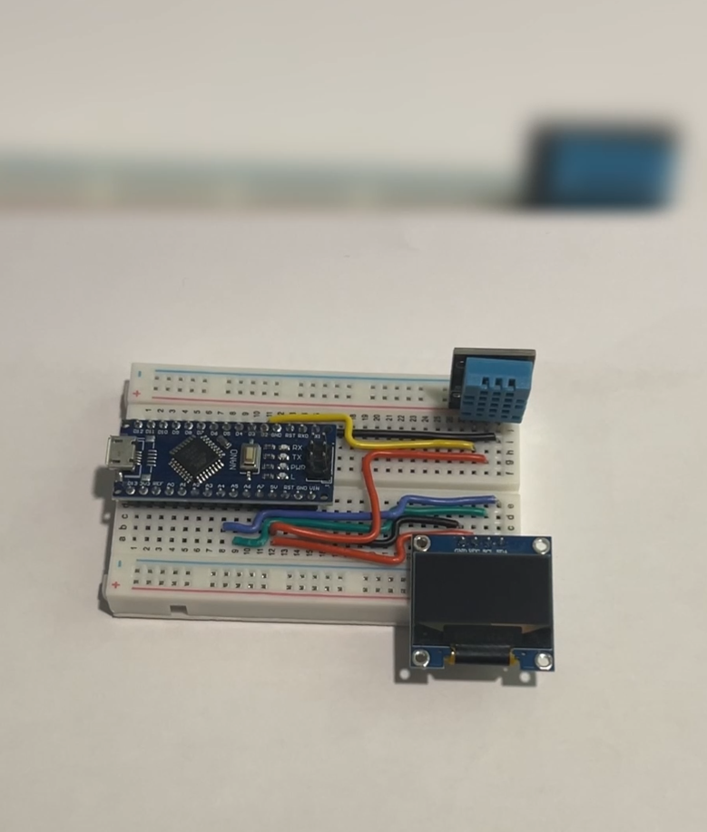
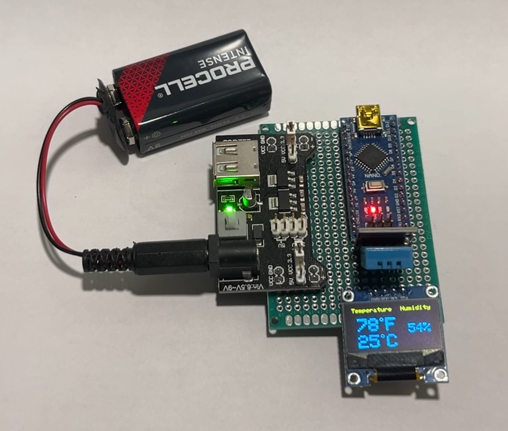

# Arduino Temperature & Humidity Monitor

A real-time environmental monitoring system using Arduino, DHT11 sensor, and SSD1306 OLED display. Monitor temperature and humidity with a clean, professional interface on a 128x64 OLED screen.

## Features

- **Real-time Monitoring**: Continuous temperature and humidity readings updated every second
- **Dual Temperature Display**: Shows temperature in both Celsius and Fahrenheit
- **High-Contrast OLED**: Clear, easy-to-read 128x64 OLED display
- **Professional Layout**: Clean interface with organized data presentation
- **Degree Symbol Graphics**: Custom-drawn degree symbols for temperature readings
- **I2C Communication**: Efficient data transfer using I2C protocol
- **Compact Design**: Minimal hardware requirements for portable applications
- **Serial Output**: Debug and data logging capabilities via serial monitor

## Hardware Requirements

### Components
- **Arduino Uno** (or compatible microcontroller)
- **DHT11 Temperature & Humidity Sensor**
- **SSD1306 OLED Display** (128x64, I2C)
- **Jumper Wires**
- **Breadboard** (optional, for prototyping)

### Pin Connections

#### DHT11 Sensor
- VCC → 5V (or 3.3V)
- GND → GND
- Data → Digital Pin 2

#### SSD1306 OLED Display (I2C)
- VCC → 5V (or 3.3V)
- GND → GND
- SDA → A4 (Arduino Uno)
- SCL → A5 (Arduino Uno)

## Required Libraries

Install the following libraries through the Arduino IDE Library Manager:

```
DHT sensor library by Adafruit
Adafruit GFX Library
Adafruit SSD1306
```

## Installation

1. **Clone or Download** this repository to your local machine
2. **Install Required Libraries** using the Arduino IDE Library Manager
3. **Open** `main.ino` in the Arduino IDE
4. **Connect** your hardware according to the pin connections above
5. **Select** your Arduino board and port in the IDE
6. **Upload** the code to your Arduino

## How to Use

1. **Power on** your Arduino with all components connected
2. **Wait** for the initial display logo to appear
3. **View** real-time readings on the OLED display:
   - Temperature in Fahrenheit (top section)
   - Temperature in Celsius (middle section)  
   - Humidity percentage (right section)
4. **Monitor** the serial output at 9600 baud for debugging (optional)

## Screenshots

### Breadboard Version


### Hardware Setup


## Display Layout

The OLED screen is organized as follows:
- **Top Left**: "Temperature" header
- **Top Right**: "Humidity" header
- **Upper Middle**: Temperature in Fahrenheit with degree symbol
- **Lower Middle**: Temperature in Celsius with degree symbol
- **Right Side**: Humidity percentage

## Customization

### Adjustable Parameters
- **Update Interval**: Modify the `delay(1000)` value in the main loop (currently 1 second)
- **Temperature Precision**: Change the decimal places in `oledDisplay()` function calls
- **Display Layout**: Adjust text size and positioning in `oledDisplay()` function
- **I2C Address**: Modify `0x3C` if your OLED uses a different address

### Code Structure
- **setup()**: Initializes serial communication, DHT sensor, and OLED display
- **loop()**: Main execution loop for reading sensors and updating display
- **oledDisplayHeader()**: Renders the header text on the display
- **oledDisplay()**: Handles positioning and formatting of sensor readings

## Technical Details

- **Sensor Accuracy**: DHT11 provides ±2°C temperature and ±5% humidity accuracy
- **Update Rate**: Readings refresh every second
- **Display Resolution**: 128x64 pixels monochrome OLED
- **Communication**: I2C protocol for OLED, digital signal for DHT11
- **Power Consumption**: Low power design suitable for battery operation
- **Operating Range**: DHT11 works from 0-50°C and 20-90% humidity

## Troubleshooting

### Common Issues
1. **"SSD1306 allocation failed"** - Check I2C connections and display address
2. **No sensor readings** - Verify DHT11 wiring and power connections
3. **Blank display** - Ensure OLED has proper power and I2C connections
4. **Incorrect readings** - Allow 2-3 minutes for sensor stabilization after power-on

### Debug Steps
1. Open serial monitor at 9600 baud to check for error messages
2. Verify all connections match the pin diagram
3. Test I2C scanner sketch to confirm OLED address
4. Try different DHT11 sensor if readings seem incorrect

## License

This project is licensed under the MIT License - see the [LICENSE](LICENSE) file for details.

## Credits

**Author**: Terminal Technology Tips  
**YouTube**: [@TerminalTechnologyTips](https://youtube.com/@TerminalTechnologyTips)

## Future Enhancements

Potential improvements for future versions:
- Data logging to SD card or EEPROM
- WiFi connectivity for remote monitoring
- Multiple sensor support
- Temperature and humidity alarms
- Historical data graphs
- Web-based dashboard
- Battery level indicator

---

**Stay informed about your environment!**
